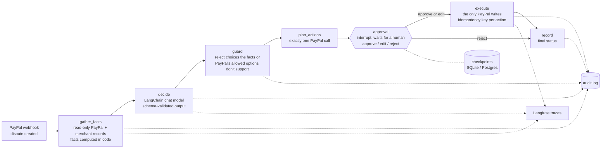

# Rebuttal

An AI agent that resolves PayPal disputes for small online shops before they turn into claims.

When a buyer opens a dispute, Rebuttal pulls the order, shipment tracking, transaction history and store policies,
works out what actually happened, and proposes the cheapest fair resolution: share tracking, offer a replacement,
refund after a return, accept quickly, or submit evidence. If the purchase was made by the buyer's AI shopping
assistant, it compares what the assistant was told to buy with what it ordered. Nothing reaches PayPal until the
merchant approves, and every step is logged.

Built for the PayPal AI Hackathon (Devpost), Oct–Nov 2026.

## Status

Working prototype. It runs against an in-memory mock of the PayPal sandbox out of the box, and the real sandbox is
wired too: the Disputes API (read, message, offer) has been exercised against it by hand
(`backend/scripts/spike_sandbox.py`). See [PLAN.md](PLAN.md) for the road to submission.

Live end to end (Oct 7, 2026): deployed on Render with Groq and Supabase Postgres, a dispute filed by a buyer in the
real PayPal sandbox arrived as a signature-verified webhook, the agent gathered the facts and drafted a resolution,
and the proposal is waiting for approval in the checkpointed workflow. No PayPal writes happened before approval.

## Run it

The backend is a [uv](https://docs.astral.sh/uv/) project (`backend/pyproject.toml`, locked in `backend/uv.lock`).
Nothing below needs a key; with no model key the offline rules baseline decides.

```bash
cd backend
uv sync                                    # creates .venv from the lockfile (Python 3.12)
uv run pytest                              # tests: never call a model, never send traces
uv run python -m evals.run --rules         # eval suite, offline baseline
uv run python -m scripts.demo              # the agent handles 6 demo disputes end to end
uv run uvicorn rebuttal.app:app --reload   # API on http://127.0.0.1:8000/docs
```

Configuration lives in `backend/.env` (copy `backend/.env.example`; the file is git-ignored):

| Setting | What it does |
|---|---|
| `ANTHROPIC_API_KEY`, `GROQ_API_KEY`, `NVIDIA_API_KEY` | Pick the model that decides, first one set wins in that order. `REBUTTAL_MODEL` / `GROQ_MODEL` / `NVIDIA_MODEL` name the model. |
| `REBUTTAL_REASONER=rules` | Never call a model, whatever keys are set. |
| `PAYPAL_CLIENT_ID`, `PAYPAL_CLIENT_SECRET`, `REBUTTAL_MOCK=0` | Run against the real PayPal **sandbox** (anything else is refused). |
| `PAYPAL_WEBHOOK_ID` | The id PayPal gives the webhook you register for `/api/webhooks/paypal`; deliveries are verified against it. |
| `REBUTTAL_API_TOKEN` | When set, every `/api` route except health and the PayPal webhook needs `Authorization: Bearer <token>`. Whoever can call approve is the human in the approval gate, so set it on any deployment. |
| `DATABASE_URL` | A `postgresql://` URL (we use a free Supabase project, session pooler on port 5432; needs `uv sync --extra postgres`). Paused proposals and the audit log then live in Postgres. Unset: SQLite, so no setup is needed to run locally. |
| `REBUTTAL_CHECKPOINT_URL` | Override for the checkpoints only: a SQLite file or a `postgresql://` URL. Default: in memory in mock mode, `checkpoints.sqlite` against the real sandbox. |
| `LANGFUSE_PUBLIC_KEY`, `LANGFUSE_SECRET_KEY`, `LANGFUSE_BASE_URL` (or `LANGFUSE_HOST`) | Turn on Langfuse tracing. Off when unset; `REBUTTAL_TRACING=0` forces it off. |

## How it works

The workflow is a [LangGraph](https://docs.langchain.com/oss/python/langgraph) graph
([`agent/graph.py`](backend/rebuttal/agent/graph.py)). Every step is plain, deterministic code except `decide`, the
only node that calls a model.



- `rebuttal/paypal/client.py`: typed PayPal REST client (Disputes, Orders, tracking, transaction search, webhooks). It
  refuses any write outside `permit_writes()`, and `read_only()` gives the analysis steps a clone whose transport
  refuses everything but GET.
- `rebuttal/paypal/mock.py`: in-memory sandbox behind `httpx.MockTransport`; the same client runs against both.
- `rebuttal/agent/`: `facts.py` (gather + hard facts), `llm.py` (LangChain chat models, Pydantic `DecisionOut`),
  `reasoner.py` (rules baseline, `guard`, prompt), `pipeline.py` (planning, evidence PDF), `graph.py` (the graph).
- `rebuttal/approval.py`: the approval interrupt and the `execute` node, the only code that writes to PayPal.
- `evals/cases.json`: 20 labeled disputes, 4 marked hard (the buyer's wording changes the right answer).

## Payments-grade guarantees

What the code enforces today, and where. Nothing here is a claim about PayPal's side beyond what is stated.

| Guarantee | How | Code |
|---|---|---|
| **Human approval before any money movement** | `analyze` stops at a LangGraph `interrupt()`; only an approve or edit decision routes to `execute`, which also refuses to run without one. Three layers keep writes in one place: analysis steps hold `client.read_only()`, whose HTTP transport refuses anything but GET; the full client raises on any write unless the caller is inside `permit_writes()`, which only `execute` (and named manual sandbox scripts) enter; and a test scans the package, scripts and evals for any other way to reach a write. A proposal can only be approved by its exact id, so a stale or newer proposal is never approved by mistake, and nothing fallible runs after the human's answer is read, so a failure cannot turn one answer into another. | [`approval.py`](backend/rebuttal/approval.py), [`graph.py`](backend/rebuttal/agent/graph.py), [`client.py`](backend/rebuttal/paypal/client.py), [`test_write_boundary.py`](backend/tests/test_write_boundary.py), [`test_graph.py`](backend/tests/test_graph.py) |
| **Idempotency keys on every PayPal write** | Every POST carries a `PayPal-Request-Id`. For approved actions it is deterministic (a UUID derived from proposal id, action index and kind), so a retry is the same request. Caveat: PayPal's OpenAPI specs document this header for Orders and Payments but not for the Disputes endpoints, so it is not relied on there. Before sending, `execute` reads the dispute and skips a message or offer that already landed (a retry after a crash), nothing fallible runs after the PayPal call, and a per-dispute lock allows one approval at a time, across threads and processes (file locks for SQLite; Postgres advisory locks are written but not yet run against a live database). Evidence and accept-claim are not reconciled: if PayPal refuses a repeat, the result says FAILED even though the first attempt may have gone through, so check the dispute. | [`idempotency_key`, `already_applied`, `execute`](backend/rebuttal/approval.py), [`DisputeLocks`](backend/rebuttal/persistence.py), [`_request`](backend/rebuttal/paypal/client.py), [`test_graph.py`](backend/tests/test_graph.py) |
| **Resumable workflows (checkpointing)** | Each dispute is a LangGraph thread (`thread_id` = dispute id) checkpointed at every step with `durability="sync"`. A proposal waiting for approval survives a restart; a crash after approval is continued with `retry`; a run that stops part-way is reported as INTERRUPTED, never as approvable. Tested with a SQLite file, in the same process and across two real processes. Postgres (Supabase) is exercised live: by `backend/tests/live_postgres.py` across separate processes, and by the deployed app, which paused a real sandbox dispute at the approval gate. | [`persistence.py`](backend/rebuttal/persistence.py), [`graph.py`](backend/rebuttal/agent/graph.py), [`test_graph.py`](backend/tests/test_graph.py) |
| **Schema-validated model output** | The model returns a Pydantic `DecisionOut` through `with_structured_output` (native JSON schema on Anthropic and Groq): unknown resolutions are rejected, numbers are clamped. Humans' decisions are validated too (`ApprovalDecision`). Anything invalid falls back to the rules baseline and says so. `guard` then checks the choice against the computed facts and PayPal's allowed options. | [`llm.py`](backend/rebuttal/agent/llm.py), [`reasoner.py`](backend/rebuttal/agent/reasoner.py), [`test_llm.py`](backend/tests/test_llm.py) |
| **Persistent audit log** | Every agent step and every PayPal write is appended to the audit log with the idempotency key: the `rebuttal_audit` table in Postgres when `DATABASE_URL` is set (next to the checkpoints, so it survives redeploys), otherwise a local JSONL file. | [`audit.py`](backend/rebuttal/audit.py) |
| **Webhook signature verification** | Every delivery to `/api/webhooks/paypal` is checked with PayPal's `verify-webhook-signature` call against `PAYPAL_WEBHOOK_ID` before anything happens (401 if forged, 503 if PayPal cannot be reached). With no webhook id set, only the local mock accepts deliveries; a real sandbox refuses them. A webhook can only start an analysis, which cannot write to PayPal. | [`app.py`](backend/rebuttal/app.py) |
| **Evals** | 20 labeled disputes, 4 hard. The report also counts PayPal writes before approval (must be 0). | [`evals/`](backend/evals), [`RESULTS.md`](backend/evals/RESULTS.md) |
| **Tracing** | Optional [Langfuse](https://langfuse.com) tracing of every graph run, tagged with dispute id and model, one session per dispute; the eval cases are a Langfuse dataset and each eval run is an experiment with a correct/incorrect score per case. Off unless the keys are set. Traces (like checkpoints) contain the case snapshot, including the buyer's name, email and address, so keep tracing off or self-hosted for anything but sandbox and test data (email addresses are masked, names and addresses are not). | [`tracing.py`](backend/rebuttal/tracing.py), [`evals/run.py`](backend/evals/run.py) |

## Eval results

See `backend/evals/RESULTS.md` after a run. The offline rules baseline scores 85% overall (100% standard, 25% hard);
the hard cases are what the model has to win. `uv run python -m evals.run --langfuse` records a run as a Langfuse
experiment.

## Sponsor tools (planned)

AG Studio (dashboard and agent), APIMatic Context Plugin (used while building the PayPal integration in Claude Code,
see [docs/apimatic-log.md](docs/apimatic-log.md)), Render (hosting), Bryntum Scheduler (backup), Elastic (optional
retrieval).

## License

MIT. See [LICENSE](LICENSE).
