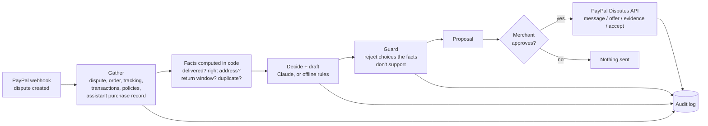

# Rebuttal

An AI agent that resolves PayPal disputes for small online shops before they turn into claims.

When a buyer opens a dispute, Rebuttal pulls the order, shipment tracking, transaction history and store policies,
works out what actually happened, and proposes the cheapest fair resolution: share tracking, offer a replacement,
refund after a return, accept quickly, or submit evidence. If the purchase was made by the buyer's AI shopping
assistant, it compares what the assistant was told to buy with what it ordered. Nothing reaches PayPal until the
merchant approves, and every step is logged.

Built for the PayPal AI Hackathon (Devpost), Oct–Nov 2026.

## Status

Working prototype against a mock PayPal sandbox. Real-sandbox spike script ready (`backend/scripts/spike_sandbox.py`).
See [PLAN.md](PLAN.md) for the road to submission.

## Run it (no keys needed)

```bash
cd backend
pip install -r requirements.txt
python -m pytest            # 8 tests
python -m evals.run --rules # eval suite, offline baseline
python -m scripts.demo      # agent handles 6 demo disputes end to end
uvicorn rebuttal.app:app --reload   # API on http://127.0.0.1:8000/docs
```

Add `ANTHROPIC_API_KEY` to `backend/.env` to switch the reasoner from the offline baseline to Claude.
Add sandbox `PAYPAL_CLIENT_ID` / `PAYPAL_CLIENT_SECRET` and set `REBUTTAL_MOCK=0` to run against the PayPal sandbox.

## How it works



- `rebuttal/paypal/client.py`: typed PayPal REST client (Disputes, Orders, tracking, transaction search, webhooks).
- `rebuttal/paypal/mock.py`: in-memory sandbox behind `httpx.MockTransport`; the same client runs against both.
- `rebuttal/agent/`: `facts.py` (gather + hard facts), `reasoner.py` (Claude / rules + guard), `pipeline.py` (actions, evidence PDF).
- `rebuttal/approval.py`: the only code path that writes to PayPal.
- `evals/cases.json`: 20 labeled disputes, 4 marked hard (the buyer's wording changes the right answer).

## Eval results

See `backend/evals/RESULTS.md` after a run. Offline baseline today: 85% overall, 100% standard, 25% hard,
0 PayPal writes before approval. The hard cases are what the AI model has to win.

## Sponsor tools (planned)

Bryntum Scheduler (deadline board), AG Studio (analytics + agent), APIMatic Context Plugin (used while building the
PayPal integration in Claude Code), Render (hosting), Elastic (optional retrieval).

## License

MIT. See [LICENSE](LICENSE).
